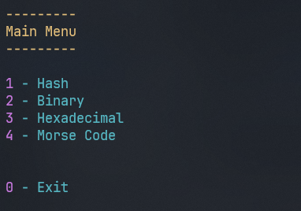
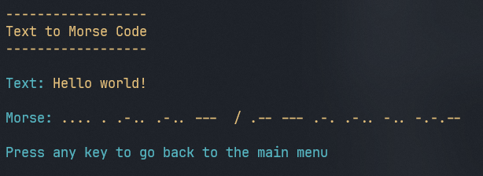
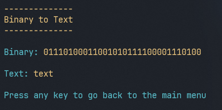

# Converter-Console
Application for converting stuff

You can convert any text to and from binary, hexadecimal, hash and morse code

This is the CLI version, link for GUI version: [https://github.com/DanielTakac/Converter-GUI](https://github.com/DanielTakac/Converter-GUI)

